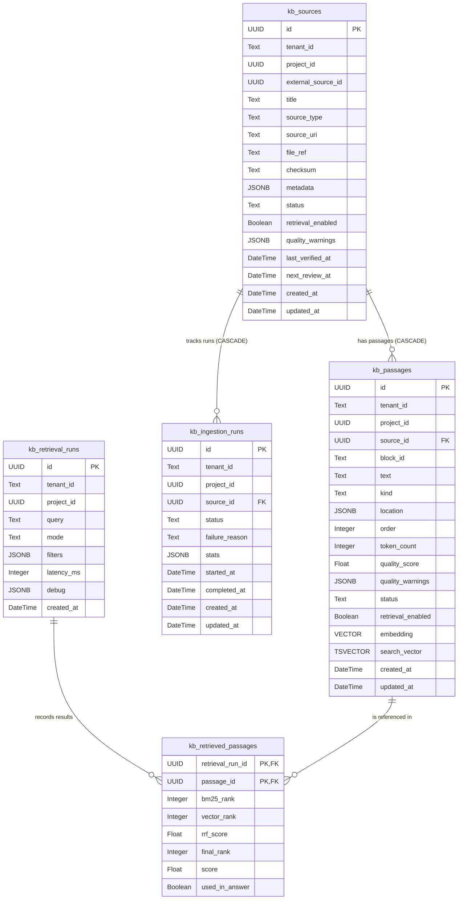

# Evidence KB Technical Reference Guide

This document provides a detailed technical reference for the internal architectures, algorithms, data models, API schemas, and database structures of the `evidence-kb` service.

---

## 1. Pipeline Architectures & Algorithms

The `evidence-kb` service implements ingestion, quality checks, embedding, and hybrid search.

### 1.1 Ingestion & Parsing
The entry point handles raw text or PDF documents.
* **Text Parser (`parse_text`)**: Captures the input text as a single string block, mapping it with a baseline `Location(start_offset=0, end_offset=len(content))`.
* **PDF Parser (`parse_pdf_bytes`)**: Powered by `PyMuPDF` (`fitz`), this parses PDF binary streams page-by-page. For each page containing non-empty text, it extracts the raw text and tags it with a page-indexed location structure: `Location(page=page_index + 1)`.

### 1.2 Recursive Chunking (`chunk_text`)
Once source blocks (e.g. pages) are extracted, they are split into overlapping chunks for indexing:
1. **Targeting**: Chunks are processed sequentially using `CHUNK_SIZE_CHARS` and `CHUNK_OVERLAP_CHARS`.
2. **Boundary Detection**: Instead of hard-truncating at the character limit, the algorithm scans backward within the target window to locate natural boundaries, looking for double newlines `\n\n` or sentence endings `. `.
3. **Lookback Constraint**: If a natural boundary is found within the last 50% of the chunk size (i.e. `boundary > start + int(target_chars * 0.5)`), the chunk is split at that boundary. Otherwise, it uses a hard split at the character limit.
4. **Overlap Adjustment**: The start of the next chunk is set to `max(end - overlap_chars, start + 1)` to maintain semantic continuity.

### 1.3 Quality Heuristics & Scoring (`score_chunk`)
Every passage chunk undergoes static quality verification. The check produces a numeric quality score and warning codes:
* **Warning Rules**:
  - `too_short`: Triggered if the chunk token count estimate is **less than 20 tokens**.
  - `too_long`: Triggered if the chunk token count estimate is **greater than 1200 tokens**.
  - `low_information`: Triggered if the count of unique lowercase words in the chunk is **less than 8**, and the token estimate is greater than 20.
* **Scoring Math**:
  - Token count is estimated using a standard ratio of **1 token per 4 characters** (`len(text) // 4`).
  - Score starts at `1.0`. Each warning subtracts `0.25` from the score.
  - The minimum quality score is clamped at `0.2` via `1.0 - min(0.8, warning_count * 0.25)`.

### 1.4 Vector Embeddings (`EmbeddingClient`)
The service interacts asynchronously with the `embedding-sidecar` microservice:
* **Connection**: Communicates via `httpx.AsyncClient` targeting the OpenAI-compatible `/v1/embeddings` endpoint.
* **Concurrency Control**: Requests are throttled using an `asyncio.Semaphore` set to a maximum of **5 concurrent requests** to prevent overwhelming the sidecar.
* **Batching**: Texts are grouped in batches of 100 before dispatch. Results are reassembled into their original order once completed.

### 1.5 Hybrid Retrieval Engine
The service uses a hybrid search implementation combining keyword search and vector distance search.

1. **Keyword/BM25 Search**: Matches terms using Postgres full-text search (`tsvector` simple configuration) over the computed `search_vector` GIN index.
2. **Vector Search**: Computes cosine distance (`1 - (embedding <=> query_embedding)`) using pgvector HNSW indices to locate semantically similar passages.
3. **Reciprocal Rank Fusion (RRF)**: Merges the results of keyword and vector search to obtain a unified rank list. RRF computes a score based on the ranks of the passage in both results:
   $$RRF(d) = \frac{1}{\text{BM25 Rank}(d) + k} + \frac{1}{\text{Vector Rank}(d) + k}$$
   where $k$ is the smoothing constant configured by `RRF_K` (default `60`). Passages are then ranked in descending order of their $RRF(d)$ score.

---

## 2. Database Schema & Migration System

The database uses PostgreSQL with the `pgvector` and standard text search schemas. The migration system is managed via Alembic.

### 2.1 Alembic Configuration
Migrations are stored in the `alembic` folder. The base migration configuration is defined in `alembic.ini`.
* **Applying Migrations**: `alembic upgrade head` runs the migrations dynamically.
* **Schema Namespace**: The environment variable `DB_SCHEMA` dynamically configures the postgres schema used (defaulting to `"evidence_kb"`).

### 2.2 Physical Schema Diagram & Layout



### 2.3 Field Specification & Constraints

#### Table `kb_sources`
- `id` (`UUID`, Primary Key)
- `tenant_id` (`Text`, Not Null)
- `project_id` (`UUID`, Not Null)
- `external_source_id` (`UUID`, Not Null)
- `title` (`Text`, Not Null)
- `source_type` (`Text`, Not Null) — Constraint: `source_type IN ('text', 'markdown', 'html', 'pdf', 'web')`
- `source_uri` (`Text`, Nullable)
- `file_ref` (`Text`, Nullable)
- `checksum` (`Text`, Nullable)
- `metadata` (`JSONB`, Not Null, default `{}`)
- `status` (`Text`, Not Null, default `'candidate'`) — Constraint: `status IN ('candidate', 'certified', 'deprecated', 'rejected')`
- `retrieval_enabled` (`Boolean`, Not Null, default `true`)
- `quality_warnings` (`JSONB`, Not Null, default `[]`)
- `last_verified_at` (`DateTime`, Nullable)
- `next_review_at` (`DateTime`, Nullable)
- `created_at` (`DateTime`, Not Null, default `now()`)
- `updated_at` (`DateTime`, Not Null, default `now()`)
- **Indexes**:
  - Unique Constraint: `(tenant_id, project_id, external_source_id)`
  - Index `kb_sources_project_idx`: `(tenant_id, project_id, created_at)`
  - Index `kb_sources_status_idx`: `(status, retrieval_enabled)`

#### Table `kb_passages`
- `id` (`UUID`, Primary Key)
- `tenant_id` (`Text`, Not Null)
- `project_id` (`UUID`, Not Null)
- `source_id` (`UUID`, Foreign Key referencing `kb_sources.id` on delete `CASCADE`)
- `block_id` (`Text`, Not Null)
- `text` (`Text`, Not Null)
- `kind` (`Text`, Not Null, default `'text'`)
- `location` (`JSONB`, Not Null, default `{}`)
- `order` (`Integer`, Not Null)
- `token_count` (`Integer`, Not Null)
- `quality_score` (`Float`, Not Null, default `1`)
- `quality_warnings` (`JSONB`, Not Null, default `[]`)
- `status` (`Text`, Not Null, default `'candidate'`) — Constraint: `status IN ('candidate', 'certified', 'deprecated', 'rejected')`
- `retrieval_enabled` (`Boolean`, Not Null, default `true`)
- `embedding` (`pgvector.VECTOR`, dimension length variable configured by `EMBEDDING_DIMENSIONS`)
- `search_vector` (`TSVECTOR`, Generated Column: `to_tsvector('simple', text)`)
- `created_at` (`DateTime`, Not Null, default `now()`)
- `updated_at` (`DateTime`, Not Null, default `now()`)
- **Indexes**:
  - Unique Constraint: `(source_id, block_id)`
  - Index `kb_passages_embedding_idx`: HNSW index over `embedding` using `vector_cosine_ops`.
  - Index `kb_passages_search_idx`: GIN index over `search_vector`.
  - Index `kb_passages_project_export_idx`: `(tenant_id, project_id, source_id, order)`
  - Index `kb_passages_project_filter_idx`: `(tenant_id, project_id, status, retrieval_enabled)`
  - Index `kb_passages_project_quality_idx`: `(tenant_id, project_id, quality_score)`
  - Index `kb_passages_source_idx`: `(source_id, order)`

#### Table `kb_ingestion_runs`
- `id` (`UUID`, Primary Key)
- `tenant_id` (`Text`, Not Null)
- `project_id` (`UUID`, Not Null)
- `source_id` (`UUID`, Foreign Key referencing `kb_sources.id` on delete `CASCADE`)
- `status` (`Text`, Not Null, default `'processing'`) — Constraint: `status IN ('queued', 'processing', 'completed', 'failed')`
- `failure_reason` (`Text`, Nullable)
- `stats` (`JSONB`, Not Null, default `{}`)
- `started_at` (`DateTime`, Not Null, default `now()`)
- `completed_at` (`DateTime`, Nullable)
- `created_at` (`DateTime`, Not Null, default `now()`)
- `updated_at` (`DateTime`, Not Null, default `now()`)
- **Indexes**:
  - Index `kb_ingestion_runs_source_idx`: `(source_id, created_at)`

#### Table `kb_retrieval_runs`
- `id` (`UUID`, Primary Key)
- `tenant_id` (`Text`, Not Null)
- `project_id` (`UUID`, Not Null)
- `query` (`Text`, Not Null)
- `mode` (`Text`, Not Null, default `'hybrid'`)
- `filters` (`JSONB`, Not Null, default `{}`)
- `latency_ms` (`Integer`, Not Null, default `0`)
- `debug` (`JSONB`, Not Null, default `{}`)
- `created_at` (`DateTime`, Not Null, default `now()`)
- **Indexes**:
  - Index `kb_retrieval_runs_project_idx`: `(tenant_id, project_id, created_at)`

#### Table `kb_retrieved_passages`
- `retrieval_run_id` (`UUID`, Primary Key, Foreign Key referencing `kb_retrieval_runs.id` on delete `CASCADE`)
- `passage_id` (`UUID`, Primary Key, Foreign Key referencing `kb_passages.id` on delete `CASCADE`)
- `bm25_rank` (`Integer`, Nullable)
- `vector_rank` (`Integer`, Nullable)
- `rrf_score` (`Float`, Nullable)
- `final_rank` (`Integer`, Not Null)
- `score` (`Float`, Not Null)
- `used_in_answer` (`Boolean`, Nullable)

---

## 3. Exhaustive API Reference

### 3.1 Security & Authentication
If the `API_KEY` setting is configured, incoming requests must include the API key in the request headers:
* **Header Name**: `X-API-Key`
* **Response on Failure**: HTTP `401 Unauthorized` (`{"detail": "Invalid API key"}`)

---

### 3.2 System & Health Group

#### Health Check
* **Path**: `GET /health`
* **Response Body**:
  ```json
  {
    "status": "ok",
    "service": "evidence-kb",
    "storage_backend": "postgres",
    "database": "connected"
  }
  ```
* **Failure Response**: Returns `status: degraded` with an error message in the `database` field if database connectivity fails when the storage backend is set to `"postgres"`.

#### Service Metadata
* **Path**: `GET /metadata`
* **Response Headers**: `Cache-Control: public, max-age=300`
* **Response Body**:
  ```json
  {
    "service": "evidence-kb",
    "chunk_size_chars": 1200,
    "chunk_overlap_chars": 160,
    "rrf_k": 60,
    "storage_backend": "postgres",
    "embedding_dimensions": 1536
  }
  ```

---

### 3.3 Ingestion Group

#### Ingest Text/HTML/Markdown Source
* **Path**: `POST /v1/ingest/source`
* **Request Schema (`IngestSourceRequest`)**:
  - `tenantId` (`str`, Required): Namespace identifier.
  - `projectId` (`UUID`, Required): ID of the project context.
  - `externalSourceId` (`UUID`, Required): ID of the source system.
  - `title` (`str`, Required): Title of the document.
  - `sourceType` (`str`, Required): Must be one of `text`, `markdown`, `html`, `web`. (Passing `pdf` returns an HTTP 422 error).
  - `text` (`str`, Optional): Plain-text content to ingest. Required for non-PDF ingestion.
  - `fileUrl` (`str`, Optional): URL to retrieve the source file content.
  - `metadata` (`dict[str, Any]`, Optional): Additional key-value pairs (default `{}`).
* **Response Schema (`IngestSourceResponse`)**:
  - `ingestionRunId` (`UUID`): ID tracking this ingestion execution.
  - `sourceId` (`UUID`): ID of the generated/updated source record.
  - `status` (`str`): Ingestion state (`queued`, `processing`, `completed`, `failed`).
  - `passageCount` (`int`): Total passages created.
  - `warningCount` (`int`): Total quality warnings triggered across all chunks.

#### Ingest PDF Document
* **Path**: `POST /v1/ingest/pdf`
* **Content-Type**: `multipart/form-data`
* **Form Parameters**:
  - `tenantId` (`str`, Required): Namespace identifier.
  - `projectId` (`UUID`, Required): ID of the project context.
  - `externalSourceId` (`UUID`, Required): ID of the source system.
  - `title` (`str`, Required): Title of the document.
  - `file` (`UploadFile`, Required): Binary PDF stream. Content-Type must be `application/pdf` or `application/octet-stream`.
* **Response Schema**: Same as `IngestSourceResponse`.

#### Get Ingestion Run Info
* **Path**: `GET /v1/ingest/runs/{run_id}`
* **Response Schema (`IngestionRunRecord`)**:
  ```json
  {
    "id": "3a8de121-72f5-46b5-9db4-a95726df948e",
    "tenant_id": "default",
    "project_id": "8b9de121-72f5-46b5-9db4-a95726df9487",
    "source_id": "8b9de121-72f5-46b5-9db4-a95726df9489",
    "status": "completed",
    "failure_reason": null,
    "stats": {
      "passageCount": 12,
      "sourceType": "pdf",
      "warningCount": 1
    }
  }
  ```
* **Error Response**: HTTP `404 Not Found` if `run_id` does not exist.

---

### 3.4 Query & Retrieval Group

#### Retrieve Passages
* **Path**: `POST /v1/retrieve`
* **Request Schema (`RetrieveRequest`)**:
  - `tenantId` (`str`, Required): Namespace identifier.
  - `projectId` (`UUID`, Required): ID of the project context.
  - `query` (`str`, Required): The search query. Maximum length: 2000 characters. Must not be empty or whitespace.
  - `topK` (`int`, Optional): Number of passages to return. Constraint: $1 \le \text{topK} \le 100$. Default: `12`.
  - `mode` (`str`, Optional): Search algorithm mode. Values: `hybrid`, `bm25_only`, `vector_only`. Default: `"hybrid"`.
  - `filters` (`dict[str, Any]`, Optional): Filters applied to metadata or retrieval state.
* **Response Schema (`RetrieveResponse`)**:
  - `retrievalRunId` (`UUID`): ID tracking this search execution.
  - `query` (`str`): The executed query.
  - `retrievalMode` (`str`): The executed search mode.
  - `contexts` (`list[RetrievedPassage]`): Ordered list of retrieved passages matching the query.
  - `debug` (`dict[str, Any]`): Contains performance metrics (e.g. `latencyMs`).

##### Context Object Schema (`RetrievedPassage`)
* `passage_id` (`UUID`): ID of the passage.
* `source_id` (`UUID`): Reference to the parent source.
* `text` (`str`): Text content of the passage.
* `score` (`float`): Score assigned by the retrieval mode.
* `bm25_rank` (`int | null`): Position in keyword-only results.
* `vector_rank` (`int | null`): Position in vector-only results.
* `rrf_score` (`float | null`): Fusion score (calculated for `hybrid` mode).
* `final_rank` (`int`): Ranked position in final contexts.
* `location` (`Location`): Chunk location coordinates in the source document.

---

### 3.5 Sources & Passages Inspections Group

#### List Project Sources
* **Path**: `GET /v1/projects/{project_id}/sources`
* **Query Parameters**:
  - `tenantId` (`str`, Required): Namespace identifier.
  - `skip` (`int`, Optional, default `0`): Pagination offset.
  - `limit` (`int`, Optional, default `1000`): Maximum records to return.
* **Response Schema**: `list[SourceRecord]` (JSON array of source details).

#### Find Stale Sources
* **Path**: `GET /v1/projects/{project_id}/sources/stale`
* **Query Parameters**:
  - `tenant_id` (`str`, Optional, default `"default"`): Namespace identifier.
  - `skip` (`int`, Optional, default `0`): Pagination offset.
  - `limit` (`int`, Optional, default `50`): Maximum records to return.
* **Response Schema**: `list[SourceRecord]`. Returns sources that are **not certified, have retrieval disabled, or have quality warnings**.

#### List Source Passages
* **Path**: `GET /v1/sources/{source_id}/passages`
* **Query Parameters**:
  - `skip` (`int`, Optional, default `0`): Pagination offset.
  - `limit` (`int`, Optional, default `1000`): Maximum records to return.
* **Response Schema**: `list[PassageRecord]`.

#### Inspect Single Passage
* **Path**: `GET /v1/passages/{passage_id}`
* **Response Schema (`PassageRecord`)**:
  ```json
  {
    "id": "5c4598d1-52f5-46b5-9db4-a95726df9489",
    "tenant_id": "default",
    "project_id": "8b9de121-72f5-46b5-9db4-a95726df9487",
    "source_id": "8b9de121-72f5-46b5-9db4-a95726df9489",
    "block_id": "block-0-0",
    "text": "Retrieval-Augmented Generation (RAG) is...",
    "kind": "text",
    "location": {
      "page": 1,
      "heading": null,
      "start_offset": 0,
      "end_offset": 120
    },
    "order": 0,
    "token_count": 30,
    "quality_score": 1.0,
    "quality_warnings": [],
    "status": "candidate",
    "retrieval_enabled": true
  }
  ```
* **Error Response**: HTTP `404 Not Found` if `passage_id` does not exist.

#### Find Weak Passages
* **Path**: `GET /v1/passages/weak`
* **Query Parameters**:
  - `project_id` (`str`, Required): Project ID.
  - `tenant_id` (`str`, Optional, default `"default"`): Namespace identifier.
  - `min_quality_score` (`float`, Optional, default `0.5`): Returns passages with a score below this threshold.
  - `skip` (`int`, Optional, default `0`): Pagination offset.
  - `limit` (`int`, Optional, default `50`): Maximum records to return.
* **Response Schema**: `list[PassageRecord]`. Returns passages matching quality flags, low scores, or rejected statuses.

---

### 3.6 Curation Group

#### Bulk Curation
* **Path**: `POST /v1/curation/bulk`
* **Query Parameters**:
  - `project_id` (`str`, Required): Project ID context.
  - `tenant_id` (`str`, Optional, default `"default"`): Namespace identifier.
* **Request Schema (`BulkCurationRequest`)**:
  - `actions` (`list[dict[str, Any]]`, Required): List of curation operations. Maximum length: 1000 items.
* **Response Schema (`BulkCurationResponse`)**:
  - `results` (`list[dict[str, Any]]`): Detailed result status for each action.
  - `total` (`int`): Total actions parsed.
  - `succeeded` (`int`): Actions applied successfully.
  - `failed` (`int`): Actions that failed validation or execution.

#### Export Passages
* **Path**: `POST /v1/curation/export`
* **Query Parameters**:
  - `project_id` (`str`, Required): Project ID context.
  - `tenant_id` (`str`, Optional, default `"default"`): Namespace identifier.
* **Request Schema (`ExportPassagesRequest`)**:
  - `source_id` (`str`, Optional): Filter by parent source ID.
  - `status` (`str`, Optional): Filter by status (`candidate`, `certified`, `deprecated`, `rejected`).
  - `format` (`str`, Optional, default `"json"`): Export payload structure format.
  - `skip` (`int`, Optional, default `0`): Offset parameter.
  - `limit` (`int`, Optional, default `1000`): Limit parameter.
* **Response Schema**:
  ```json
  {
    "passages": [...],
    "total": 1
  }
  ```

---

## 4. Curation Action Catalog

The `/v1/curation/bulk` endpoint supports the following action types:

### 4.1 `certify_source`
Mark a source status as `"certified"`.
* **Payload**:
  ```json
  {
    "type": "certify_source",
    "sourceId": "8b9de121-72f5-46b5-9db4-a95726df9487"
  }
  ```

### 4.2 `certify_passage`
Mark a specific passage status as `"certified"`.
* **Payload**:
  ```json
  {
    "type": "certify_passage",
    "passageId": "5c4598d1-52f5-46b5-9db4-a95726df9489"
  }
  ```

### 4.3 `deprecate_source`
Mark a source status as `"deprecated"`.
* **Payload**:
  ```json
  {
    "type": "deprecate_source",
    "sourceId": "8b9de121-72f5-46b5-9db4-a95726df9487"
  }
  ```

### 4.4 `reject_source`
Mark a source status as `"rejected"`.
* **Payload**:
  ```json
  {
    "type": "reject_source",
    "sourceId": "8b9de121-72f5-46b5-9db4-a95726df9487"
  }
  ```

### 4.5 `reject_passage`
Mark a specific passage status as `"rejected"`.
* **Payload**:
  ```json
  {
    "type": "reject_passage",
    "passageId": "5c4598d1-52f5-46b5-9db4-a95726df9489"
  }
  ```

### 4.6 `set_source_retrieval_enabled`
Enable or disable retrieval for all passages belonging to a source.
* **Payload**:
  ```json
  {
    "type": "set_source_retrieval_enabled",
    "sourceId": "8b9de121-72f5-46b5-9db4-a95726df9487",
    "enabled": false
  }
  ```

### 4.7 `set_passage_retrieval_enabled`
Enable or disable retrieval for a specific passage chunk.
* **Payload**:
  ```json
  {
    "type": "set_passage_retrieval_enabled",
    "passageId": "5c4598d1-52f5-46b5-9db4-a95726df9489",
    "enabled": true
  }
  ```

### 4.8 `add_quality_warning`
Manually append a warning code to a source or passage chunk.
* **Payload**:
  ```json
  {
    "type": "add_quality_warning",
    "passageId": "5c4598d1-52f5-46b5-9db4-a95726df9489",
    "warning": "manual_review_needed"
  }
  ```

### 4.9 `clear_quality_warning`
Remove a warning code from a source or passage. If the `warning` key is omitted, it clears all quality warnings associated with the record.
* **Payload**:
  ```json
  {
    "type": "clear_quality_warning",
    "passageId": "5c4598d1-52f5-46b5-9db4-a95726df9489",
    "warning": "manual_review_needed"
  }
  ```
